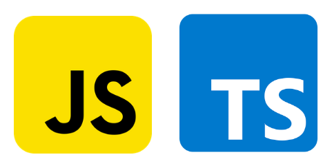
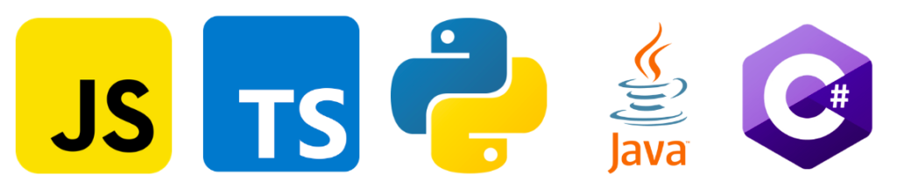
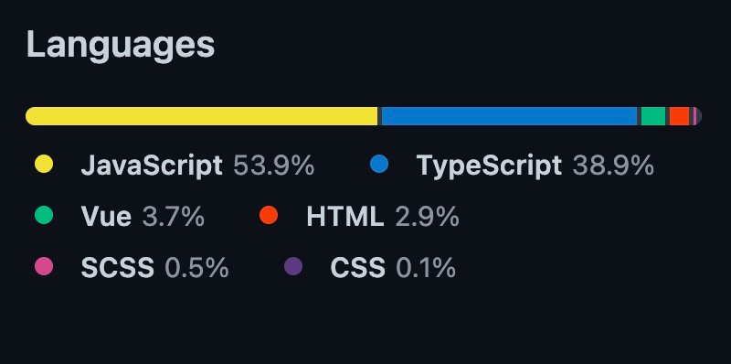
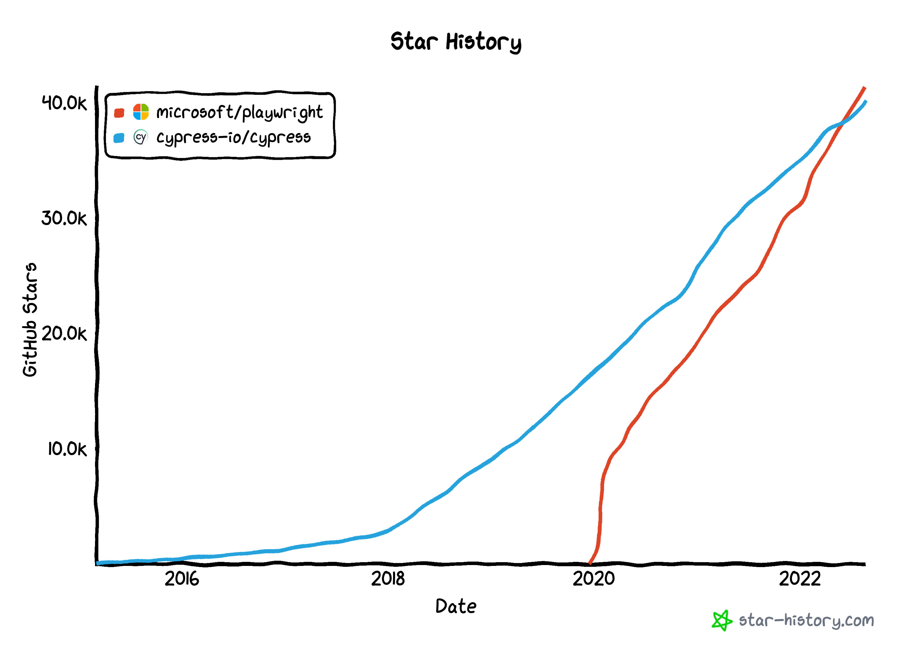

<figure style="text-align: center;">
    
</figure>

# About me

### Website: https://www.zeljkovic.sh
### LinkedIn: https://www.linkedin.com/in/a-zeljkovic  
### GitHub: https://github.com/azeljkovic  
### Twitter: https://twitter.com/a_zeljkovic
### Email: [aleksandar@zeljkovic.sh]()

# Technical details and architecture

|                                      | <figure style="text-align: center;">        </figure>                                                                                              | <figure style="text-align: center;">        </figure>                                                    |
|--------------------------------------|------------------------------------------------------------------------------------------------------------------------------------------------------------------------------------------------------------------|------------------------------------------------------------------------------------------------------------------------------------------------------------------------------|
| Language support                     | <figure style="text-align: center;">        </figure>                                                          | <figure style="text-align: center;">        </figure>                |
| Browser support                      | <figure style="text-align: center;">        </figure> _Notes_: https://docs.cypress.io/guides/references/roadmap | <figure style="text-align: center;">        </figure>                  |
| GitHub repository language breakdown | <figure style="text-align: center;">        </figure>                                           | <figure style="text-align: center;">        </figure> |

# Documentation, community and support
|                    | <figure style="text-align: center;">        </figure> | <figure style="text-align: center;">        </figure> |
|--------------------|---------------------------------------------------------------------------------------------------------------------|---------------------------------------------------------------------------------------------------------------------------|
| Docs               | https://docs.cypress.io                                                                                             | https://playwright.dev/docs/intro                                                                                         |
| YouTube            | https://www.youtube.com/Cypressio                                                                                   | https://www.youtube.com/c/Playwrightdev                                                                                   |
| GitHub issues      | https://github.com/cypress-io/cypress/issues                                                                        | https://github.com/microsoft/playwright/issues                                                                            |
| StackOverflow      | https://stackoverflow.com/questions/tagged/cypress                                                                  | https://stackoverflow.com/questions/tagged/playwright                                                                     |
| Chat               | https://discord.gg/bkcR8bvUBZ                                                                                       | https://aka.ms/playwright-slack                                                                                           |
| Ambassador program | https://www.cypress.io/ambassadors                                                                                  | https://playwright.dev/community/ambassadors                                                                              |

# Pace of development (August 2022)

|                     | <figure style="text-align: center;">        </figure> | <figure style="text-align: center;">        </figure> |
|---------------------|---------------------------------------------------------------------------------------------------------------------|---------------------------------------------------------------------------------------------------------------------------|
| Release cycle       | Major releases are made approximately 3 times a year, with several minor/patches in between.                        | Major releases are made monthly, with bug fixes and browser updates in between.                                           |
| Changelog           | https://docs.cypress.io/guides/references/changelog                                                                 | https://github.com/microsoft/playwright/releases                                                                          |
| GitHub stars        | 40.1k                                                                                                               | 41.4k                                                                                                                     |
| Open/Closed issues  | 2.7k/8.4k                                                                                                           | ~630/5.9k                                                                                                                 |
| GitHub contributors | ~380                                                                                                                | ~280                                                                                                                      |

---

<figure style="text-align: center;">
      
    <figcaption>GitHub stars history</figcaption>
</figure> 

# Setup

There are two different types of Playwright installation:

- Playwright library – minimal and browser automation focused.
- Playwright test – Playwright library extended with the testing framework,
  enables assertions, reporting, parallelization, etc.
  Focused on e2e test automation.

|                      | <figure style="text-align: center;">        </figure> | <figure style="text-align: center;">        </figure> |
|----------------------|---------------------------------------------------------------------------------------------------------------------|---------------------------------------------------------------------------------------------------------------------------|
| Install - npm        | `npm install cypress --save-dev`                                                                                    | `npm install @playwright/test --save-dev`  then  `npx playwright install --with-deps`                           |
| Install - yarn       | `yarn add cypress --dev`                                                                                            | `yarn create playwright`                                                                                                  |
| Scaffold new project | Via UI, after the first `npx cypress open`                                                                          | `npm init playwright@latest`                                                                                              |

# Writing tests
## Application under test
https://github.com/cypress-io/cypress-realworld-app  
Frontend: http://localhost:3000  
Backend: http://localhost:3001

## !Show me the code!

