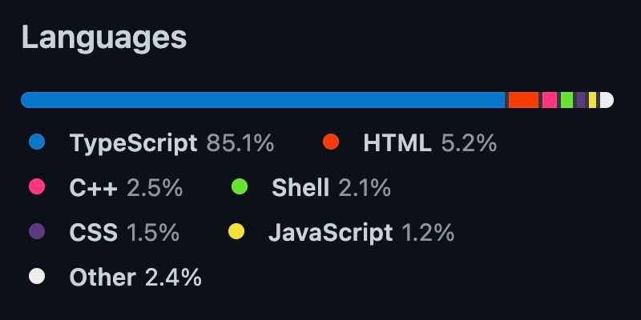

<figure style="text-align: center;">
    
</figure>

# About me

Website: https://www.zeljkovic.sh  

GitHub: https://github.com/azeljkovic  
LinkedIn: https://www.linkedin.com/in/a-zeljkovic  
Twitter: https://twitter.com/a_zeljkovic

# Technical details and architecture
## Cypress

> Fast, easy and reliable testing for anything that runs in a browser.  
> *Cypress*

<figure style="text-align: center;">
      
    <figcaption>Languages supported by Cypress</figcaption>
</figure>

 
 

<figure style="text-align: center;">
      
    <figcaption>Browsers supported by Cypress</figcaption>
</figure>  

*Notes:*
 - https://github.com/cypress-io/cypress/issues?q=is%3Aissue+is%3Aopen+sort%3Acomments-desc
 - https://docs.cypress.io/guides/references/roadmap

<figure style="text-align: center;">
      
    <figcaption>Cypress GitHub repository language breakdown</figcaption>
</figure>  

## Playwright

> Playwright is a framework for Web Testing and Automation. It allows testing Chromium, Firefox and WebKit with a single API.  
> *Playwright*

<figure style="text-align: center;">
      
    <figcaption>Languages supported by Playwright</figcaption>
</figure>

 
 
  
<figure style="text-align: center;">
      
    <figcaption>Browsers supported by Playwright</figcaption>
</figure>  

*Notes:*
 - https://github.com/microsoft/playwright/issues?q=is%3Aissue+is%3Aopen+sort%3Acomments-desc

<figure style="text-align: center;">
      
    <figcaption>Playwright GitHub repository language breakdown</figcaption>
</figure> 

# Documentation, community and support
## Cypress
https://docs.cypress.io  
https://www.youtube.com/Cypressio  
https://github.com/cypress-io/cypress/issues  
https://stackoverflow.com/questions/tagged/cypress  
https://discord.gg/bkcR8bvUBZ  

Cypress Ambassadors: “Our network of Cypress experts, dedicated to spreading knowledge, sharing best practices, and building community.”

Additional prominent community-powered Cypress resources are:

https://glebbahmutov.com/blog – a blog written by Gleb Bahmutov  
https://filiphric.com/blog – a blog written by Filip Hric

## Playwright
https://playwright.dev/docs/intro  
https://www.youtube.com/c/Playwrightdev  
https://github.com/microsoft/playwright/issues  
https://stackoverflow.com/questions/tagged/playwright  
https://aka.ms/playwright-slack  

Ambassador program announced...

# Pace of development
## Cypress

https://github.com/cypress-io/cypress  
https://docs.cypress.io/guides/references/changelog  
https://docs.cypress.io/guides/references/roadmap  

Some interesting stats around Cypress code (Jun 2022):  
- 38.9k stars  
- 2.5k opened/7.9k closed issues  
- ~360 contributors  
- major releases are made approximately 3 times a year, with several minor/patches in between

## Playwright

https://github.com/microsoft/playwright  
https://github.com/microsoft/playwright/releases  

Some interesting stats around Playwright code (Jun 2022):  
- 39.1k stars
- ~540 opened/5.1k closed issues
- ~240 contributors
- major releases are made monthly, with bug fixes and browser updates in between

---

<figure style="text-align: center;">
      
    <figcaption>GitHub stars history</figcaption>
</figure> 
